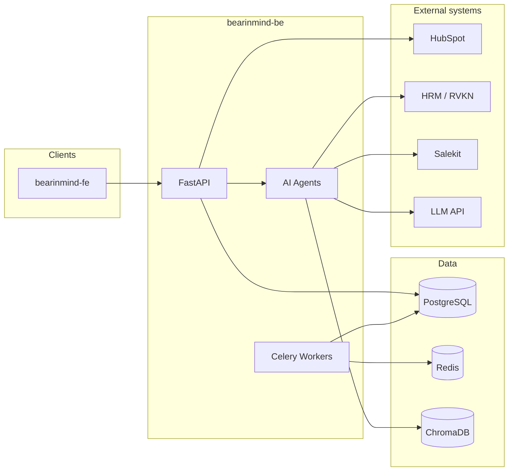

# Bear In Mind — Backend & AI Architecture

High-level design for the **FastAPI** service, **LangGraph/LangChain** agents, data stores, and integrations. Product context: [`../project_overview.md`](../project_overview.md). User stories: [`../user_stories.md`](../user_stories.md).

---

## 1. Context (C4 Level 1)

---

## 2. Logical components

| Component | Responsibility |
|-----------|----------------|
| **API layer** | HTTP routes, auth, validation (Pydantic), OpenAPI. No heavy LLM logic in routers. |
| **Services** | Orchestrate repositories, agents, and external calls; transactions. |
| **Matching agent (US1)** | Parse opportunity text → entities → vector search over unit/case embeddings → rank → format units + rationale + contact. |
| **CRM sync agent (US5)** | Extract opportunity from conversation → user confirmation → create/update HubSpot deal → persist sync state. |
| **Memory agent (US3, US4)** | Load prior unit profile → incremental Q&A → persist → trigger re-embed. |
| **Opportunity query (US6)** | Merge **local** opportunities (unofficial) with **HubSpot** list; apply filters. |
| **Notification pipeline (US2)** | On new/relevant opportunity → create notification rows for matching leaders; optional real-time channel later. |
| **Reminder jobs (US4)** | Celery Beat → enqueue reminder → preloader injects “previous context” into message payload. |
| **Integrations** | Thin `httpx` clients: HubSpot, HRM, Salekit; retries and error mapping. |

---

## 3. Data stores

| Store | Role |
|-------|------|
| **PostgreSQL** | Units, opportunities, conversation metadata, notifications, capability snapshots, sync audit fields. |
| **Redis** | Celery broker; optional cache for HubSpot list responses. |
| **ChromaDB** | Vector index of unit capability text + case study snippets; re-index on capability update. |

---

## 4. API surface (reference)

Paths are indicative; version under `/api/v1/` if needed.

| Method | Path | User story | Notes |
|--------|------|------------|--------|
| `POST` | `/chat` | US1 | Matching + chat turn |
| `POST` | `/opportunities` | US5 | Create/update draft from agent |
| `PUT` | `/opportunities/{id}/push-crm` | US5 | Confirmed HubSpot push |
| `GET` | `/opportunities` | US6 | Filters: status, source, unit, … |
| `PUT` | `/units/{id}/capabilities` | US3 | Capability CRUD + re-embed trigger |
| `GET` | `/notifications` | US2 | Polling list; mark read |

### UI-friendly chat payloads (for frontend interactive components)

The `/chat` response is expected to include **presentation-ready structures** in addition to plain text:

- `analysis_card`: summary block (title + colored tags + footer hint)
- `suggestions`: rich unit suggestion cards (match level, capability/resource tags, case studies, contact presentation hints)

These are documented in OpenAPI and should be treated as part of the stable FE contract.

### OpenAPI as the source of truth

For cross-team alignment (FE mocking and API stability), use:

- `docs/design/openapi.json` — exported from the running FastAPI app
- `scripts/export_openapi.py` — one-shot export script

---

## 5. Background processing

- **Celery worker**: HubSpot long operations (if moved async), heavy re-embedding, notification fan-out.
- **Celery Beat**: US4 periodic reminders (e.g. weekly).

Idempotent tasks: safe retries for reminders and sync.

---

## 6. Security & configuration

- Secrets via environment (`pydantic-settings`); never log tokens or full CRM payloads.
- HubSpot: OAuth or private app token per deployment docs.
- Rate limiting and backoff on external APIs.

---

## 7. Observability

- Structured logging with `request_id` / `conversation_id` / `opportunity_id`.
- Health check: `GET /health` (API + DB connectivity).

---

**Version**: 1.0  
**Date**: 2026-04-09
