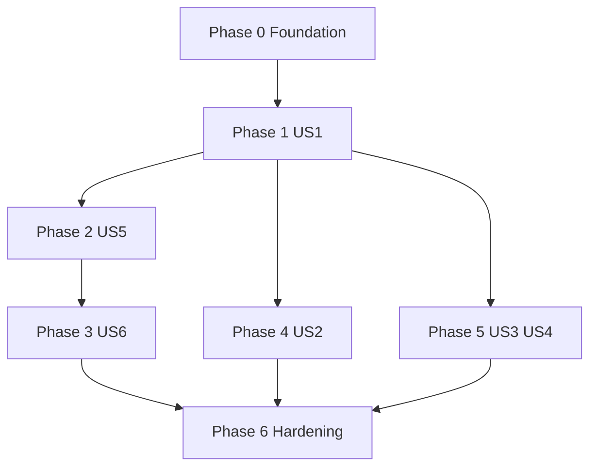

# Bear In Mind — Backend Implementation Plan

Phased delivery for **bearinmind-be**, aligned with [`../user_stories.md`](../user_stories.md). Adjust dates and owners to your sprint board.

**Status legend:** `Not started` | `In progress` | `Done`

---

## Phase 0 — Foundation

**Goal:** Runnable API shell, local infrastructure, configuration.

| Task | Output | Status |
|------|--------|--------|
| Repository layout (`app/`, `core/config`, `api`, `db`) | FastAPI `main`, health check | Done |
| Docker Compose | PostgreSQL, Redis, ChromaDB | Done |
| `.env.example` + `pydantic-settings` | Documented variables | Done |
| Alembic init | Baseline migration | Done |
| LangGraph/LangChain scaffold | LLM config, single smoke graph | Done |
| Auth scaffold | JWT + password hashing + sample user routes | Done |

**Exit criteria:** `docker compose up`, `GET /health` OK, one test LLM call in dev.

---

## Phase 1 — US1 Matching (core)

**Goal:** End-to-end chat → ranked units + rationale + contact.

| Task | Output | Status |
|------|--------|--------|
| Unit schema + seed data | Tables for divisions, experts, contacts | Not started |
| ChromaDB indexing pipeline | Embed capability + case text | Not started |
| Matching agent | Entity extract → retrieve → rank → format | Not started |
| `POST /chat` | Stable JSON contract for frontend (includes `analysis_card` + `suggestions` for interactive UI) | In progress |
| Tests | Integration test on matching path | Not started |

**Exit criteria:** Frontend can drive matching from real API; response includes units + reasons + contact.

---

## Phase 2 — US5 Opportunity + HubSpot

**Goal:** Persist opportunities from conversation; confirm; push to CRM.

| Task | Output | Status |
|------|--------|--------|
| Opportunity schema | `is_official`, `source`, `pushed_at`, … | Not started |
| HubSpot integration module | Create/update deal | Not started |
| CRM sync agent | Confirm → push → persist result | Not started |
| `POST /opportunities`, `PUT /opportunities/{id}/push-crm` | OpenAPI documented | Not started |

### Contract handoff note (FE alignment)

- Use `openapi.json` (root dir) as the **single source of truth** for request/response shapes.
- Export/update it via `python -m scripts.export_openapi` whenever routes/schemas change.

**Exit criteria:** Demo flow: chat → save draft → confirm → deal visible in HubSpot (or mock).

---

## Phase 3 — US6 Multi-source list

**Goal:** Leaders see official + unofficial opportunities.

| Task | Output | Status |
|------|--------|--------|
| HubSpot list fetch | Normalized opportunity DTO | Not started |
| Merge service | Local + HubSpot with dedupe rules | Not started |
| `GET /opportunities` | Filters + pagination | Not started |

**Exit criteria:** Dashboard can show mixed pipeline; filters work.

---

## Phase 4 — US2 Notifications

**Goal:** Leaders see when a new opportunity fits their unit.

| Task | Output | Status |
|------|--------|--------|
| Notification schema | Link to opportunity + unit + fit level | Not started |
| Match trigger hook | After opportunity create/match → insert notifications | Not started |
| `GET /notifications` | Polling; optional mark-read | Not started |

**Exit criteria:** Creating a matching opportunity surfaces a notification row for the right leader.

---

## Phase 5 — US3 + US4 Capabilities, memory, reminders

**Goal:** D.Lead updates; scheduled reminders with context.

| Task | Output | Status |
|------|--------|--------|
| `PUT /units/{id}/capabilities` | Validation + persist + re-embed | Not started |
| HRM / Salekit tools | Stub or real clients | Not started |
| Memory agent | Incremental update flow | Not started |
| Celery Beat + worker | Reminder schedule + idempotent sends | Not started |

**Exit criteria:** Capability edit updates search results; reminder fires on schedule with prior context.

---

## Phase 6 — Hardening & handoff

| Task | Output | Status |
|------|--------|--------|
| E2E smoke | US1 → US5 → US6 path | Not started |
| Production Docker / compose | Documented runbook | Not started |
| README / env | Matches deployed stack | Not started |

---

## Dependency overview

---

**Version**: 1.2  
**Date**: 2026-04-09
