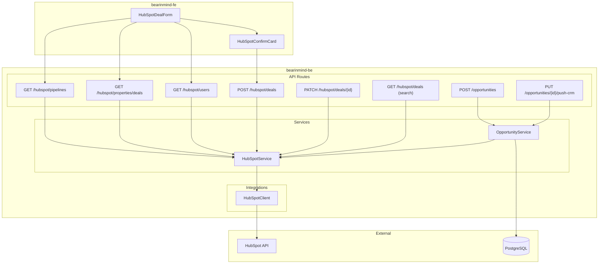

# Phase 2: US5 -- HubSpot Integration Plan

## HubSpot API Primer

Before diving into the plan, here is a quick explanation of the core HubSpot CRM concepts that our integration touches.

### What is a Deal?

A **Deal** is HubSpot's representation of a sales opportunity -- a potential revenue-generating engagement with a client. In Rikkeisoft's context, each deal represents a project opportunity (e.g. "D365 implementation for Fujitsu Japan").

### What are Properties?

**Properties** are the metadata-defined fields that describe a deal. Think of them as the "columns" of a deal record. Each property has:

- **`name`** (internal ID): machine-readable key used in API calls, e.g. `dealname`, `dealstage`, `market`, `onsiteoffshoretype`. These are sometimes human-readable strings, but can also be random IDs like `hs_v2_cumulative_time_in_1234`.
- **`label`** (display name): human-readable, e.g. "Deal Name", "Market", "Onsite/Offshore Type".
- **`type`**: data type -- `string`, `number`, `date`, `enumeration`, etc.
- **`fieldType`**: UI widget hint -- `text`, `select`, `checkbox`, `radio`, `date`, `number`, `textarea`.
- **`options`**: for `enumeration`-type properties, the list of valid values. Each option has its own `value` (ID) and `label`. For example, the `market` property has options `EA`, `JP`, `TH`, `US`, `KR`.
- **`formField`**: whether this property appears on HubSpot forms. FE filters on `formField = true` to decide what to show in the deal creation form.

**Why this matters**: When creating a deal via API, you send `[{ "name": "dealname", "value": "Fujitsu D365" }]`. The `name` must match a real property. The `value` for enum fields must match an option `value`, not the `label`. The Properties API gives you the full catalog so the form can be built dynamically.

**For AI learning**: When reading deal data back (e.g. for training or context), the raw data contains property `name`s and option `value`s. To get human-readable text, you reverse-map: look up the property's `label` and the option's `label`. For example: `{ name: "market", value: "JP" }` -> "Market: JP". Or: `{ name: "service_level", value: "custom_sw_dev_scratch_feat" }` -> "Service Level: Custom Software Development (scratch, feature addition, etc.)".

### What are Pipelines?

A **Pipeline** represents a sales workflow with ordered stages. Think of it like a Kanban board for deals.

- **Pipeline**: a named workflow, e.g. "26RKJP Pipeline" (Rikkeisoft Japan), "26RKDN Pipeline" (Rikkeisoft Da Nang).
- **Stages**: the columns in that Kanban board, in order. Rikkeisoft's stages follow a letter-based progression:
  - `Approaching` -> `D` (Proposal Preparation) -> `C1` (Proposal Submitted OSDC/Haken) -> `C2` (Proposal Submitted Based) -> `O` (Hearing) -> `B` (Won) -> `A` (Signed/Closed Won) -> `F` (Lost/Closed Lost)
- Each stage has a `stageId`, `probability` (win likelihood), and `isClosed` flag.

**Why this matters**: When creating a deal, you specify `pipeline` (which pipeline it belongs to) and `dealstage` (which stage it starts in). The Pipelines API gives you valid pipeline + stage combinations so the form can show the right dropdowns.

### What are Users?

**Users** are the HubSpot account members (your team). Used to populate:
- **Owner** (`hubspot_owner_id`): the primary person responsible for the deal.
- **Sub-owner** (`deal_sub_owner`): secondary responsible person.
- Various section leads (per market).

The Users API returns `id`, `email`, `firstName`, `lastName`. The `id` is what gets sent as the property value when creating a deal.

### How Deal Creation Works (end-to-end)

```
1. FE loads form metadata (either three calls or one):
   GET /hubspot/bootstrap      -> pipelines + form-field properties + users (recommended)
   or: GET /hubspot/pipelines, GET /hubspot/properties/deals?form_field_only=true, GET /hubspot/users

2. User fills the form (deal name, pipeline, stage, market, owner, etc.)

3. FE sends the draft to BE:
   POST /hubspot/deals  { dealName: "...", pipeline: "...", status: "D", ... }

4. BE maps draft fields to HubSpot property names:
   dealName    -> { name: "dealname",         value: "..." }
   status      -> { name: "dealstage",        value: "D"   }
   owner       -> { name: "hubspot_owner_id", value: "90617141" }
   ...

5. BE calls HubSpot API:
   POST https://api.hubapi.com/deals/v1/deal/
   Body: { properties: [{ name, value }, ...] }

6. HubSpot returns { dealId: 123456789, ... }

7. BE responds: { success: true, hubspot_deal_id: "123456789" }
```

### API Versions We Use

| Purpose | Endpoint | Version |
|---------|----------|---------|
| Pipelines | `GET /crm-pipelines/v1/pipelines/deals` | Legacy v1 |
| Properties | `GET /crm/v3/properties/deals` | v3 |
| Users | `GET /settings/v3/users` | v3 |
| Create deal | `POST /deals/v1/deal/` | Legacy v1 |
| Update deal | `PATCH /crm/v3/objects/deals/{id}` | v3 |
| Search deals | `POST /crm/v3/objects/deals/search` | v3 |

We use legacy v1 for deal creation because the FE direct mode was already built against that format (`properties: [{ name, value }]`). The v3 create API uses a different shape (`properties: { key: value }`). Staying on v1 for create means zero FE changes when switching from `direct` to `backend` mode.

---

## Current State (post-implementation)

### Completed:
- `Settings` class loads `HUBSPOT_API_KEY` and `HUBSPOT_BASE_URL` from env ([app/core/config.py](../../app/core/config.py))
- Async HTTP client with retry/backoff at `app/integrations/hubspot_client.py`
- HubSpot service layer with field mapping at `app/services/hubspot_service.py`
- Full `HubSpotDealDraft` schema covering all 28 FE `DealDraft` fields ([app/schemas/hubspot_deal.py](../../app/schemas/hubspot_deal.py))
- All 4 FE-requested proxy endpoints implemented ([app/api/routes/hubspot.py](../../app/api/routes/hubspot.py)):
  - `GET /api/v1/hubspot/pipelines`
  - `GET /api/v1/hubspot/properties/deals` (optional query `form_field_only=true` to match HubSpot form fields only)
  - `GET /api/v1/hubspot/users`
  - `POST /api/v1/hubspot/deals` (real HubSpot API call)
- **Bootstrap** (one round-trip for the deal form, per FE team note): `GET /api/v1/hubspot/bootstrap` returns `{ pipelines, properties, users }` with properties pre-filtered to `formField=true`.
- **Reverse mapping for AI** ([app/services/hubspot_service.py](../../app/services/hubspot_service.py)): `humanize_deal_properties()` resolves HubSpot internal names and option values to human-readable labels.
- **Dev smoke tests** ([app/api/routes/dev.py](../../app/api/routes/dev.py)), non-production only:
  - `GET /api/v1/dev/smoke/llm` — verifies `LLM_API_KEY` / `LLM_BASE_URL` with a minimal chat completion.
  - `GET /api/v1/dev/smoke/hubspot` — verifies `HUBSPOT_API_KEY` via `settings/v3/users` (returns user count, no secrets).
- Extended endpoints:
  - `PATCH /api/v1/hubspot/deals/{deal_id}` (update existing deal)
  - `GET /api/v1/hubspot/deals/{deal_id}` (get single deal)
  - `GET /api/v1/hubspot/deals` (search/list deals for US6)
- Opportunity CRUD with real PostgreSQL persistence ([app/services/opportunity_service.py](../../app/services/opportunity_service.py))
- `PUT /api/v1/opportunities/{id}/push-crm` wired to actual HubSpot deal creation
- `openapi.json` re-exported with all new routes

### Architecture



---

## Implementation Details

### Task 1: HubSpot Config + HTTP Client (DONE)

**Goal**: Foundation for calling HubSpot APIs with retry and error handling.

**1a. HubSpot fields added to `Settings`** ([app/core/config.py](../../app/core/config.py)):

```python
hubspot_api_key: str = ""
hubspot_base_url: str = "https://api.hubapi.com"
```

**1b. HTTP client** at `app/integrations/hubspot_client.py`:

- `httpx.AsyncClient` with `Bearer` token auth
- Base URL from settings
- Retry logic (exponential backoff, 3 attempts) for rate limit (429) and server errors (5xx)
- Timeout config (connect=5s, read=15s)
- Error mapping: HubSpot error response -> custom `HubSpotAPIError` exception with `status_code`, `category`, `correlation_id`
- Methods: `get_pipelines()`, `get_properties()`, `get_users()`, `create_deal()`, `update_deal()`, `get_deal()`, `search_deals()`

---

### Task 2: HubSpot Service Layer (DONE)

**Goal**: Business logic between API routes and the HTTP client.

**File**: `app/services/hubspot_service.py`

- Field mapping dictionary: 27 entries mapping `DealDraft` Python field names to HubSpot internal property names (e.g. `deal_name` -> `dealname`, `status` -> `dealstage`, `owner` -> `hubspot_owner_id`)
- `draft_to_hubspot_properties()`: converts a `HubSpotDealDraft` into legacy v1 `[{name, value}]` format, including array-to-semicolon serialization for multi-select fields
- Extra field pass-through: any FE-sent field not in the explicit map is forwarded as-is (in case FE sends HubSpot property names directly)
- Metadata normalizers: raw HubSpot JSON -> typed Pydantic schemas
- Deal CRUD: `create_deal()`, `update_deal()`, `get_deal()`, `search_deals()`

---

### Task 3: Metadata Proxy Endpoints (DONE)

**Goal**: FE switches from `direct` (FE -> HubSpot) to `backend` (FE -> BE -> HubSpot) without behavior changes.

All in [app/api/routes/hubspot.py](../../app/api/routes/hubspot.py):

- `GET /api/v1/hubspot/pipelines` -- returns `{ results: Pipeline[] }`
- `GET /api/v1/hubspot/properties/deals` -- returns `{ results: HubSpotProperty[] }`
- `GET /api/v1/hubspot/users` -- returns `{ results: HubSpotUser[] }`

Response shape wraps data in `{ results: [...] }` to match what FE `hubspotApi.ts` expects in backend mode.

---

### Task 4: Real Deal Create Endpoint (DONE)

**Goal**: Replace stub with real HubSpot API call.

`POST /api/v1/hubspot/deals`:

1. Validates `HubSpotDealDraft` (Pydantic, camelCase aliases for FE compat)
2. Maps fields to HubSpot properties via `draft_to_hubspot_properties()`
3. Calls HubSpot `POST /deals/v1/deal/`
4. On success: returns `{ success: true, hubspot_deal_id: "...", message: "..." }`
5. On failure: raises HTTP 502 with HubSpot error details

---

### Task 5: Opportunity Persistence (DONE)

**Goal**: Replace in-memory stub routes with real PostgreSQL operations.

**File**: `app/services/opportunity_service.py`

- `create_opportunity()`: inserts row into `opportunities` table
- `get_opportunity()`, `list_opportunities()`, `update_opportunity()`: standard CRUD
- `push_to_crm()`: loads opportunity from DB, creates HubSpot deal, updates `hubspot_deal_id` + `pushed_at` + `is_official` on the row

All routes in `app/api/routes/opportunities.py` now use the service with injected `AsyncSession`.

---

### Task 6: Schema Updates + OpenAPI Export (DONE)

- `HubSpotDealDraft` expanded from 12 to 28 fields covering all FE `DealDraft` fields
- Added response schemas: `HubSpotPipelinesResponse`, `HubSpotPropertiesResponse`, `HubSpotUsersResponse`, `HubSpotDealUpdateResponse`, `HubSpotDealSearchResponse`
- `openapi.json` re-exported with all new endpoints

---

## Extended Features (DONE)

### Deal Update (PATCH)
- `PATCH /api/v1/hubspot/deals/{deal_id}` -- update an existing HubSpot deal
- Uses v3 API (`PATCH /crm/v3/objects/deals/{id}`) with `{ properties: { key: value } }` format

### Deal Search / List (US6 prep)
- `GET /api/v1/hubspot/deals` -- search deals with optional filters (`dealstage`, `pipeline`)
- `GET /api/v1/hubspot/deals/{deal_id}` -- get a single deal by ID
- Uses v3 search API (`POST /crm/v3/objects/deals/search`)

---

## Future Enhancements (not yet implemented)

### 1. Reverse Property Mapping for AI Context -- **High priority**
When feeding deal data to the AI for learning/context, raw property names and option values are not human-readable. Need a reverse-mapping utility:
- Load properties from HubSpot (or cache)
- Given `{ name: "service_level", value: "custom_sw_dev_scratch_feat" }`, resolve to `"Service Level: Custom Software Development (scratch, feature addition, etc.)"`
- This makes deal data meaningful for the LLM matching engine
- Reference: FE dev HoangVT's note on mapping `name` -> `label` and option `value` -> option `label`

### 2. Company Lookup -- **Medium priority**
- `GET /crm/v3/objects/companies` -- search companies by name
- Auto-suggest when user types a client name in the deal form
- Helps link deals to the correct company, reducing manual entry errors

### 3. Contact Search -- **Medium priority**
- `GET /crm/v3/objects/contacts` -- search contacts by email/name
- Validate PIC (Person In Charge) -- PM HieuNN noted that contact names are sometimes in Latin when Kanji is expected; AI could detect and warn

### 4. Redis Caching for Metadata -- **Low priority**
- Cache pipelines, properties, and users responses in Redis (TTL 5 min)
- Metadata changes rarely; caching reduces HubSpot API calls and latency
- Currently not implemented; direct pass-through on every request

### 5. Deal Stage History / Activity Timeline -- **Nice-to-have**
- Retrieve stage transition history for a deal
- Display in opportunity detail: "Deal moved from C1 -> C2 on 2026-04-10"

### 6. Associations (Deal <-> Company <-> Contact) -- **Nice-to-have**
- Create HubSpot associations between deals, companies, and contacts
- Currently FE sends `companies` as a normal property (not an association)

### 7. AI-Powered Deal Enrichment -- **Differentiator**
- After matching units (US1), AI auto-prefills the deal form:
  - `dealName` from opportunity title
  - `market` from extracted market
  - `serviceCategory` from tech stack analysis
  - `pipeline` suggestion based on deal type
- Reduces manual entry, speeds up deal creation

---

## Technical Notes

- **API Version**: Legacy v1 for deal create (FE-aligned), v3 for metadata/search/update. Documented in code.
- **Auth**: Private app token (Bearer header). No OAuth flow needed for demo.
- **Rate Limiting**: HubSpot free tier = 100 calls/10s. Client has exponential backoff.
- **Error Handling**: HubSpot error categories (`VALIDATION_ERROR`, `RATE_LIMIT`, etc.) mapped to meaningful HTTP responses.
- **Testing**: Mock HubSpot responses for unit tests; integration tests with real API are optional.

---

**Version**: 2.0
**Date**: 2026-04-14
